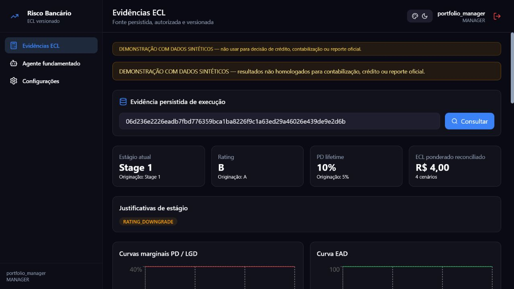

# Risco Bancário — núcleo demonstrativo de ECL

Plataforma de engenharia para estudar perda esperada de crédito, IFRS 9 e a
Resolução CMN 4.966 com dados exclusivamente sintéticos. O repositório reúne
domínio tipado, fábrica longitudinal, modelos de PD/LGD/EAD, staging, cálculo
ECL por cenário, persistência versionada, API FastAPI, workspace React e pacote
de evidências regulatórias.

> **Limite de uso:** este projeto não foi homologado por instituição financeira
> nem certificado pelo Banco Central do Brasil. Os modelos quantitativos atuais
> permanecem `not_approved` por limitações amostrais e institucionais. Saídas
> regulatórias são candidatos pré-validados localmente, nunca reportes oficiais.

## Quickstart de um comando

Requer Windows PowerShell e Python 3.13. O comando cria o `venv`, instala as
dependências de desenvolvimento e valida o import canônico:

```powershell
powershell -NoProfile -ExecutionPolicy Bypass -File .\scripts\setup.ps1
```

Depois, execute a jornada sintética completa:

```powershell
.\venv\Scripts\python.exe scripts\e2e_pipeline.py
```

O resultado esperado é `COMPLETED_WITH_MODEL_APPROVAL_BLOCKERS`: a jornada
termina tecnicamente e preserva as reprovações de PD, SICR, LGD e EAD. Os
artefatos são gravados em `evidence/e2e/`.

## O que é canônico

- `src/domain`: entidades imutáveis, datas, percentuais e valores monetários;
- `src/models`: componentes PD, LGD, EAD, staging e validação;
- `src/ecl`: cálculo por período/cenário, ajustes e reconciliação;
- `src/infrastructure`: migrations, persistência explícita e observabilidade;
- `src/interfaces/api`: API v1 com JWT, RBAC, auditoria e jobs limitados;
- `src/regulatory`: leiautes versionados, pré-validação e rastreabilidade;
- `frontend`: workspace React que lê somente evidência persistida;
- `backend`: implementação legada preservada para regressão e transição, não o
  motor canônico.

SQLite e PostgreSQL são selecionados explicitamente. Uma falha de PostgreSQL
jamais provoca fallback silencioso para SQLite.

## Demonstração local

Para subir API e frontend com containers, copie o perfil sem segredos e execute:

```powershell
Copy-Item .env.local.example .env.local
$env:RISK_ENV_FILE = ".env.local"
docker compose --profile local up --build
```

O frontend fica em `http://127.0.0.1:8080` e o OpenAPI em
`http://127.0.0.1:8000/docs`. Não há credenciais embutidas: crie um usuário pelo
bootstrap descrito no [contrato da API](docs/api/ECL_API_V1.md).



## Verificação

O gate local reproduz Black, Ruff, MyPy, testes canônicos e legados, cobertura,
auditorias de segurança e build do frontend:

```powershell
.\venv\Scripts\python.exe scripts\quality.py
```

A cobertura mínima do código canônico é 70%. Golden cases independentes ficam
em `docs/golden_cases/`, e o pacote de rastreabilidade exportado fica em
`evidence/regulatory/`.

## Guias

- [Arquitetura do sistema](docs/architecture/SYSTEM_ARCHITECTURE.md)
- [Tutorial de ECL](docs/tutorials/ECL_TUTORIAL.md)
- [Exemplos da API](docs/api/EXAMPLES.md)
- [Guia para entrevista técnica](docs/portfolio/TECHNICAL_INTERVIEW_GUIDE.md)
- [Jornada E2E e semântica dos bloqueios](docs/operations/E2E_JOURNEY.md)
- [Limitation Register](docs/validation/LIMITATION_REGISTER.md)
- [Pacote regulatório](docs/regulatory/REGULATORY_PACKAGE.md)

## Escopo regulatório

O desenho usa IFRS 9 e CMN 4.966 como requisitos de engenharia e mantém fontes,
decisões, limitações e testes rastreáveis. O XSD oficial e as críticas do BCB não
estão versionados; portanto, o Documento 3040 gerado recebe somente o status
`PREVALIDATED_DERIVED_XSD`. A adaptação a uma instituição exige dados reais,
validação independente, governança, aprovação dos modelos e homologação dos
processos e leiautes aplicáveis.
