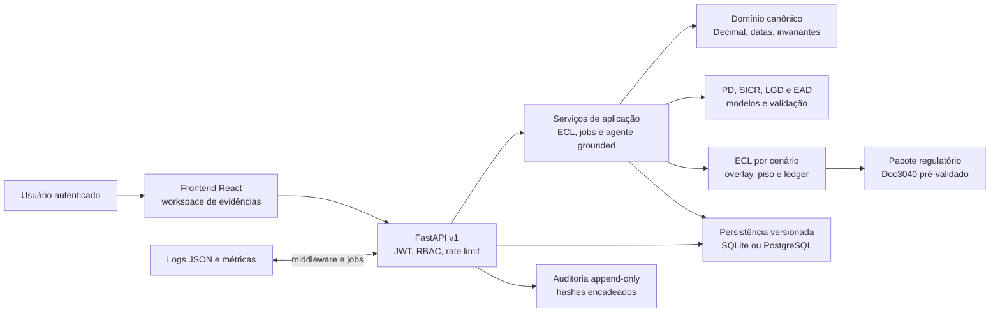
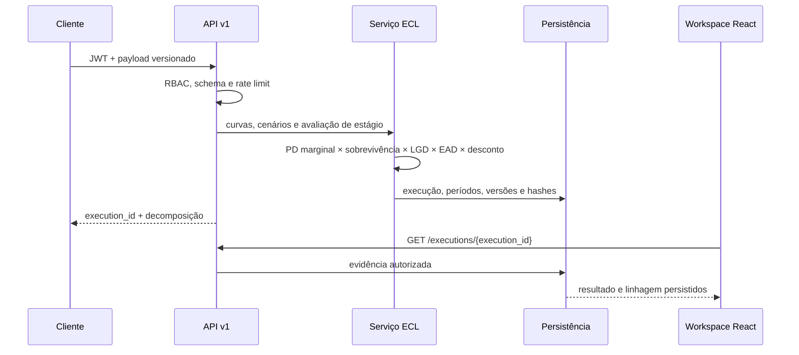

# Arquitetura do sistema canônico

## Visão executável

O sistema separa domínio, aplicação e adaptadores. Regras quantitativas não
dependem de FastAPI, React, pandas ou banco; cada fronteira converte seus dados
para contratos explícitos. O diretório `backend/` permanece apenas como legado
de transição e não participa da jornada E2E canônica.

## Fluxo de uma execução

## Decisões importantes

- Dinheiro usa `Decimal` e arredondamento explícito; `float` é recusado no
  domínio.
- Stage 1 limita a curva a 12 meses; Stage 2 usa o horizonte lifetime recebido.
- Cenários carregam pesos e versões. Stress pode existir com peso zero e continua
  visível como sensibilidade.
- ECL econômico, overlay gerencial, piso regulatório e ECL reportado são camadas
  separadas; ausência é `NOT_APPLIED`/`null`, nunca zero presumido.
- A API recebe curvas de risco, não variáveis cadastrais brutas, e não chama o
  pipeline heurístico legado.
- A seleção de SQLite ou PostgreSQL é explícita e falha fechada.
- O agente consulta somente evidências autorizadas e produz citações internas;
  não conclui conformidade oficial.

## Componentes e provas

| Componente | Implementação | Evidência principal |
|---|---|---|
| Domínio | `src/domain` | testes de invariantes e ADR-001 |
| Modelos | `src/models` | model cards, OOT, backtesting e limitation register |
| ECL | `src/ecl` | golden cases e ledger reconciliado |
| Persistência | `src/infrastructure/database` | migrations com checksum e testes de idempotência |
| Segurança | `src/security`, `src/audit` | JWT, RBAC, confirmações, trilha append-only |
| API | `src/interfaces/api` | OpenAPI e testes de contrato/injeção |
| Frontend | `frontend/src/pages/ecl` | leitura fail-closed da execução persistida |
| Regulação | `src/regulatory` | pacote exportado e matriz de rastreabilidade |

Detalhes estão em `ADR-001-domain-architecture.md`, `PERSISTENCE_VERSIONING.md`,
`AUDIT_TRAIL.md` e `docs/security/THREAT_MODEL.md`.
