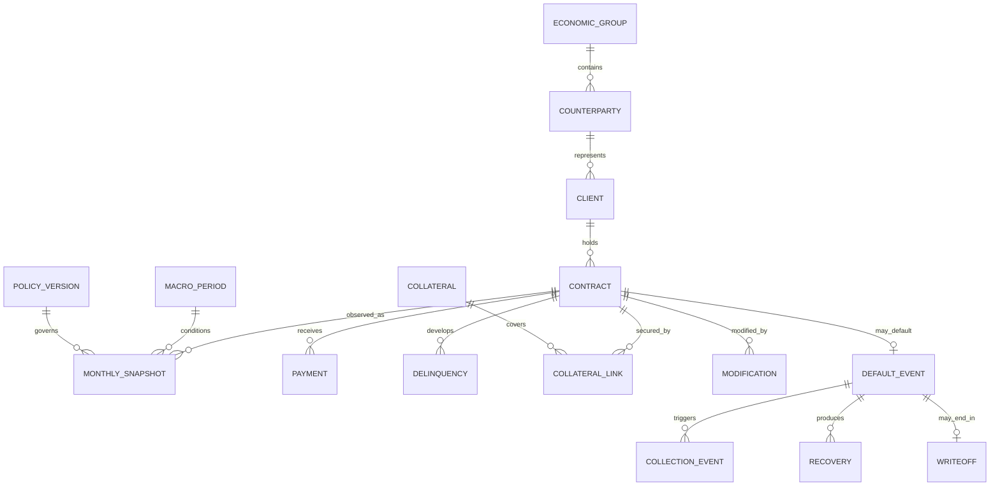

# Desenho da fábrica de dados sintéticos longitudinais

## Objetivo e fronteira

A fábrica produzirá uma população longitudinal reproduzível para desenvolver e
testar PD, LGD, EAD, SICR, ECL, reportes e controles. Ela não simula clientes
reais nem busca reproduzir uma carteira institucional específica. Toda saída é
sintética e deve carregar `dataset_version`, `generator_version`, `policy_version`,
`seed`, `generated_at` e intervalo de datas.

O gerador vive em `src/data/synthetic` e não importa pipelines de treino ou
modelos estimados. Datasets de modelagem são construídos posteriormente em uma
camada separada, apenas a partir das tabelas públicas geradas.

## Grafo de entidades

Chaves são substitutas, estáveis e sem significado (`client_id`, `contract_id`,
etc.). Datas e relações devem respeitar integridade referencial: um snapshot não
precede originação; default não precede exposição; recuperação/cobrança não
precede default; write-off não precede os critérios de baixa.

## Relógio e ordem causal mensal

O horizonte padrão será de 120 meses, com safras mensais. Para cada mês `t`, a
ordem é fixa:

1. avançar estado macroeconômico observado;
2. aplicar transições de emprego, renda e capacidade financeira;
3. processar pagamentos, utilização, amortização e novas disposições;
4. atualizar atraso, comportamento e sinais de risco observáveis;
5. registrar o snapshot de fechamento de `t`;
6. sortear eventos de `t+1` a partir do estado até `t`;
7. após default, processar cobrança, garantia, recuperação, cura, redefault e
   write-off em meses posteriores.

Assim, features na data de observação `t` nunca consultam eventos sorteados para
`t+1` ou depois. O target de default em 12 meses é calculado somente depois da
simulação completa: vale um se existir `default_date` em `(t, t+12 meses]`.

## Variáveis latentes internas

Estados latentes existem para produzir dependência causal imperfeita, não para
rotular previamente uma classe de risco:

- resiliência financeira e preferência de liquidez da contraparte;
- estabilidade de emprego/renda e exposição setorial;
- disciplina de pagamento e propensão dinâmica a utilizar limites;
- severidade idiossincrática de choque;
- eficiência de cobrança e fricção judicial;
- qualidade física/liquidez real da garantia;
- propensão a renegociar e capacidade pós-cura;
- regime macroeconômico verdadeiro antes do ruído de observação.

Todos variam no tempo por processos estocásticos e choques; nenhum determina
sozinho default. Variáveis observáveis são medições ruidosas e defasadas de
consequências desses estados.

Latentes ficam em um estado privado `_latent` mantido apenas em memória ou em
artefato de diagnóstico explicitamente separado e ignorado pelo Git. Exportação
usa allowlists de schema; nomes com prefixo `_latent`, colunas não declaradas e
IDs de substream aleatória causam falha. Testes anti-leakage devem comprovar que
nenhum dataset público ou de modelagem contém esses campos.

## Ciclo macroeconômico

O cenário histórico observado alterna regimes de expansão, estabilidade,
recessão e recuperação por uma cadeia de Markov versionada. Cada regime gera
trajetórias autocorrelacionadas mensais de atividade/PIB, inflação, juros,
desemprego e endividamento. Transições possuem duração mínima e máxima para
evitar alternância irreal a cada mês.

Efeitos são defasados e não lineares: desemprego e juros afetam renda disponível,
utilização e atraso com lags distintos; recessão amplifica risco de segmentos
vulneráveis; liquidez de garantias e tempo de recuperação deterioram sob stress.
O macro observado recebe ruído de medição diferente do regime interno.

## Dinâmica de cliente e contrato

### Renda e emprego

Emprego segue estados `employed`, `informal`, `unemployed`, `retired` ou
`inactive`, condicionados por perfil, setor e macro. Renda evolui por tendência,
inflação, choques e transição de emprego. O valor observado pode ter atraso e
erro de cadastro; o valor verdadeiro permanece interno.

### Utilização e pagamentos

Produtos amortizados usam cronograma contratual e taxa efetiva. Rotativos têm
limite, saldo utilizado, pagamento mínimo e disposição futura. Utilização reage
a liquidez, renda disponível, sazonalidade e juros. Pagamento é limitado por
caixa disponível e prioridades, sem usar o default futuro.

### Atraso e default

Atraso emerge da diferença entre obrigação e pagamento. A hazard mensal de
default é função versionada de histórico de atraso, utilização, queda observada
de renda, carga financeira, modificações, macro e efeitos aleatórios. O default
é sorteado mês a mês por substream independente. Não existe coluna estática
`risk_class` usada simultaneamente para fabricar features e target.

Ratings são observações derivadas apenas do histórico disponível e podem reagir
com atraso. O evento de default possui definição, motivo e política vigentes;
Stage/SICR serão calculados depois por regras próprias, não impostos pelo gerador.

## Garantias, renegociação, cura e perdas

Garantias possuem tipo, valor inicial, avaliações periódicas, senioridade,
enforceability, haircut e custo/tempo de execução. Valor recuperável após default
depende da trajetória de mercado, depreciação, custos e atraso de realização,
sem exceder exposição e valor líquido disponível.

Renegociação é um evento com termos antigos/novos, concessão, motivo e data. Pode
reduzir prestação, estender prazo ou capitalizar atraso, mas não apaga o histórico.
Cura exige sequência futura de pagamentos e estabilidade; período e critérios
são parâmetros versionados, não rótulo retroativo. Após cura permanece hazard de
redefault elevada e observável por coorte.

Cobranças e recuperações são fluxos mensais posteriores ao default: pagamentos,
acordos, execução de garantia e custos judiciais/operacionais. Write-off ocorre
por política documentada quando a expectativa de recuperação satisfaz o critério,
sem encerrar cobranças; recuperações pós-baixa continuam em tabela própria.

## Reprodutibilidade e independência aleatória

Uma seed mestre deriva substreams nomeadas por componente e entidade usando hash
estável. Adicionar uma coluna não deve alterar defaults já gerados. Cada execução
produz manifesto com parâmetros, hashes de configuração/schema, versões, seed,
contagens e checksums dos arquivos. Mesma entrada e versões produzem mesmos bytes
após ordenação e serialização canônicas.

## Contratos de saída

Tabelas públicas serão Parquet com schema versionado e datas em UTC/data civil
conforme ADR-001. Incluem clientes, contrapartes/grupos, contratos, snapshots,
pagamentos, atrasos, defaults, cobranças, recuperações, garantias, limites,
modificações, write-offs, macro e insumos regulatórios. Valores monetários usam
decimais de precisão declarada; percentuais não são misturados com pontos
percentuais.

O builder de modelagem recebe apenas essas tabelas públicas e uma
`observation_date`. Ele cria treino, validação, calibração, OOT e backtesting por
cortes temporais, nunca por amostragem aleatória de linhas do mesmo contrato.

## Testes obrigatórios nas próximas tarefas

- integridade de chaves e cardinalidades;
- monotonicidade temporal e ordem dos eventos;
- reprodutibilidade por seed e independência de substreams;
- ausência de latentes e colunas futuras nas allowlists;
- target reconstruído exclusivamente de eventos posteriores;
- nenhum contrato compartilhado entre partições temporais incompatíveis;
- reconciliação de saldos, fluxos, recuperações, garantias e write-offs;
- distribuições, coortes, transições macro e taxas de evento plausíveis;
- teste negativo que injeta uma feature futura e exige bloqueio.

## Decisões não tomadas nesta fase

Distribuições e coeficientes numéricos serão configuração versionada e testada
na implementação. O desenho não afirma que parâmetros demonstrativos representam
qualquer instituição. Critérios regulatórios de estágio, provisão e reporte não
são embutidos como verdade no gerador; eles consomem os eventos sintéticos em
camadas canônicas separadas.
