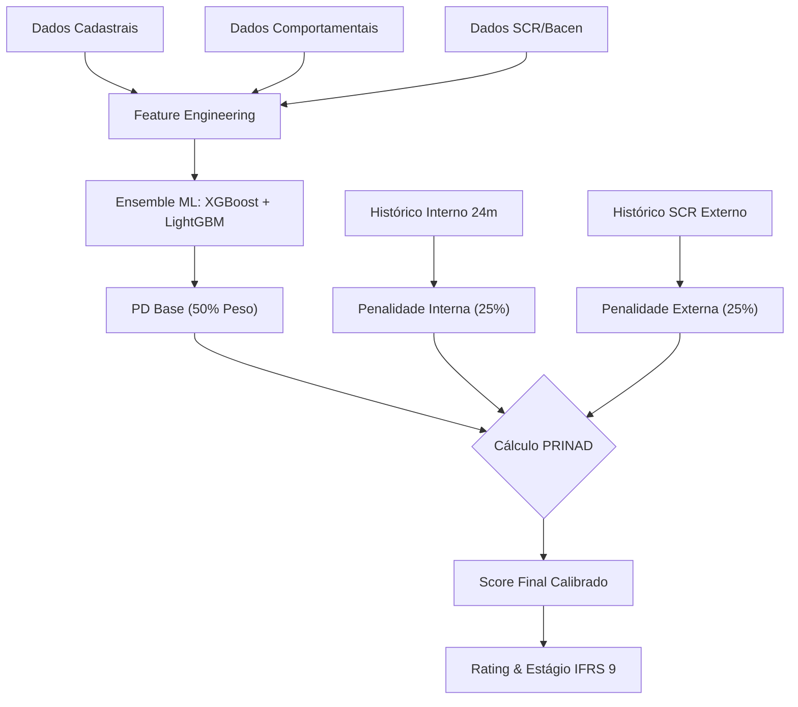

# 🏦 Módulo PRINAD - Motor de Risco de Crédito

Este diretório contém o pacote completo para implantação, treinamento e execução do modelo **PRINAD (Probabilidade de Inadimplência)**. O sistema foi desenhado para atender às normativas **BACEN 4966** e **IFRS 9**, fornecendo classificação de risco, cálculo de PD (Probabilidade de Default) e estadiamento de perda esperada.

---

## 📜 Fundamentação Regulatória e Basel III

O modelo PRINAD segue a abordagem **Internal Ratings-Based (IRB)** do Acordo de Basileia III, atendendo aos seguintes requisitos:

* **Horizonte de Predição**: 12 meses (PD 12m) e Lifetime (para IFRS 9).
* **Floor de PD**: Mínimo de 0.05% (5 bps) para clientes não-default.
* **Granularidade**: Escala de 11 níveis de rating (A1 a DEFAULT).
* **Interpretabilidade**: Uso de SHAP values para explicação individual de decisões (compliance LGPD/Art. 20).
* **Componente Histórico**: Análise de comportamento de 24 meses (Lookback Period).

---

## 🏗️ Arquitetura do Modelo

O pipeline de decisão é híbrido, combinando Machine Learning avançado com Regras de Negócio prudenciais:



### Componentes do Score

1. **PD Base (50%)**: Probabilidade bruta gerada pelo Ensemble (XGBoost + LightGBM), calibrada via Regressão Logística (Meta-Learner).
2. **Penalidade Interna (25%)**: Avalia o histórico de atrasos do cliente **dentro do banco** nos últimos 24 meses (requisito incluído pela Enedina).
3. **Penalidade Externa (25%)**: Avalia o risco sistêmico via dados do **SCR (Banco Central)**.

> **Fórmula Final**: `PRINAD = min(100%, PD_Base × (1 + Pen_Interna + Pen_Externa))`

---

### 🧠 A Inteligência do Motor de Decisão PRINAD

Para garantir a máxima precisão na concessão de crédito, nosso sistema não depende de uma única opinião. Utilizamos uma arquitetura avançada chamada **Ensemble (Comitê de Modelos)**, onde três "especialistas digitais" trabalham em conjunto para avaliar cada cliente.

Aqui está como cada componente contribui para a decisão final:

#### 1. O Especialista Detalhista (XGBoost)

O primeiro analista do nosso comitê é o **XGBoost**.

- **O que ele faz:** Ele é extremamente minucioso. Ele analisa os dados do cliente criando centenas de "árvores de decisão" sequenciais. Imagine que ele faz perguntas em cadeia: *"O cliente tem renda acima de X? Se sim, ele tem atrasos recentes? Se não, qual a idade?"*.
- **O diferencial:** O grande trunfo do XGBoost é que ele aprende com os próprios erros. Se ele errou a análise de um perfil específico no passado, ele cria novas regras focadas especificamente em corrigir esse tipo de erro. Ele é excelente para capturar padrões complexos e sutis de comportamento de risco.

#### 2. O Especialista em Velocidade e Volume (LightGBM)

O segundo analista é o **LightGBM**.

- **O que ele faz:** Ele também usa árvores de decisão, mas com uma estratégia diferente, focada em eficiência e em lidar com grandes volumes de dados.
- **O diferencial:** Enquanto o XGBoost é profundo, o LightGBM é ágil e tem uma visão mais generalista. Ele é muito bom em garantir que o modelo não fique "viciado" em detalhes irrelevantes (overfitting) e traz uma segunda opinião robusta, garantindo que não estamos deixando passar nada óbvio.

#### 3. O Juiz do Comitê (Logistic Regression / Meta-Learner)

Depois que os dois especialistas dão seus pareceres (ex: XGBoost diz "Risco 80%" e LightGBM diz "Risco 60%"), entra em cena o nosso **Meta-Learner**.

- **O que ele faz:** Ele não olha mais para a renda ou idade do cliente; ele olha apenas para **quem está dando a opinião**.
- **A inteligência:** Ele aprendeu historicamente em quem confiar mais em cada situação. O algoritmo calcula matematicamente: *"Historicamente, quando o XGBoost está muito pessimista e o LightGBM está otimista, quem costuma acertar?"*.
- **O resultado:** Ele pondera as opiniões dos dois modelos anteriores para gerar uma **Probabilidade Final Calibrada**. Ele atua como um gestor de risco experiente que sabe ouvir sua equipe e tomar a decisão final mais equilibrada e segura.

**Resumo para o Negócio:**
Não confiamos a decisão de milhões de reais a um único algoritmo. Nosso sistema simula um comitê de crédito onde especialistas com visões diferentes debatem cada proposta, e um juiz imparcial pondera essas visões para entregar a probabilidade de inadimplência (PD) mais precisa possível.

---


## 📂 Estrutura do Pacote

- **`modelos/`**: Scripts Python contendo toda a lógica de negócio, pipeline de dados e treinamento.
- **`artefatos/`**: Arquivos binários (`.joblib`) do modelo treinado e relatórios de performance.
- **`api/`**: Aplicação REST (FastAPI) para servir o modelo em produção.
- **`docs/`**: Documentação técnica detalhada (Requisitos de Dados, API, Notebook).
- **`requirements.txt`**: Lista de dependências Python necessárias.

---

## 🚀 Guia de Início Rápido

### 1. Preparação do Ambiente

Certifique-se de ter Python 3.10+ instalado. Instale as dependências:

```bash
pip install -r requirements.txt
```

### 2. Separação e Carga de Dados

O modelo requer arquivos de dados (CSV) na pasta `dados/` (não incluída no repo por segurança). Crie `banpara/dados` e adicione:

1. **`base_clientes.csv`**: Dados cadastrais (CPF, Renda, Idade, etc.).
2. **`base_3040.csv`**: Dados comportamentais históricos (V-Columns).
3. *(Opcional)* `scr_mock_data.csv`: Dados do SCR para simulação.

> 📄 **Detalhes dos Campos**: Consulte `docs/requisitos_dados.md`.

### 3. Como Treinar o Modelo

Para retreinar com novos dados:

```bash
cd modelos
python train_model.py
```

O script executa todo o pipeline: Carga -> Feature Engineering -> SMOTE -> Treino Ensemble -> Validação -> Exportação de Artefatos.

### 4. Como Executar a API

Para inferência em produção:

```bash
cd api
python api.py
```

Acesse a documentação interativa em: `http://localhost:8000/docs`

> ⚠️ **Nota de Integração**: A API foi desenhada para receber **apenas o CPF** (ou lista de CPFs) como entrada. O sistema busca automaticamente os dados cadastrais e comportamentais nas bases internas carregadas.

---

## 🧠 Lógica de Negócio Detalhada

### Escala de Rating e Ações Sugeridas

| Rating            | Faixa PD        | Descrição          | Ação Sugerida                         |
| ----------------- | --------------- | -------------------- | --------------------------------------- |
| **A1**      | 0.00% - 4.99%   | Risco Mínimo        | Aprovação automática, melhores taxas |
| **A2**      | 5.00% - 14.99%  | Risco Muito Baixo    | Aprovação automática                 |
| **A3**      | 15.00% - 24.99% | Risco Baixo          | Aprovação com análise simplificada   |
| **B1**      | 25.00% - 34.99% | Risco Baixo-Moderado | Análise padrão                        |
| **B2**      | 35.00% - 44.99% | Risco Moderado       | Análise detalhada                      |
| **B3**      | 45.00% - 54.99% | Risco Moderado-Alto  | Análise rigorosa, possíveis garantias |
| **C1**      | 55.00% - 64.99% | Risco Alto           | Exige garantias ou fiador               |
| **C2**      | 65.00% - 74.99% | Risco Muito Alto     | Negação ou condições especiais      |
| **C3**      | 75.00% - 84.99% | Risco Crítico       | Negação, exige garantias sólidas     |
| **D**       | 85.00% - 94.99% | Pré-Default         | Negação, monitoramento intensivo      |
| **DEFAULT** | > 95.00%        | Inadimplência       | Cobrança / Recuperação de Crédito   |

### Regra de Cura (Perdão)

O modelo implementa um período de cura de **6 meses**. Se o cliente permanecer 6 meses consecutivos sem atrasos internos E externos (SCR), as penalidades históricas são zeradas, permitindo a reabilitação do score.

### Integração SCR (Banco Central)

O modelo consome dados do SCR para compor a penalidade externa. Em produção, os campos críticos são:

* `valorVencido`: Montante em atraso no SFN.
* `valorPrejuizo`: Montante baixado como prejuízo (Gera penalidade máxima).
* `classificacaoRisco`: Rating BCB (AA a H).

---

## 📜 Descrição dos Scripts (`/modelos`)

| Arquivo                         | Descrição e Responsabilidade                                                                                                        |
| ------------------------------- | ------------------------------------------------------------------------------------------------------------------------------------- |
| `classifier.py`               | **Core do Sistema**. Classe principal que carrega os artefatos e orquestra a classificação. Aplica regras de rating e IFRS 9. |
| `train_model.py`              | Script mestre de treinamento. Executa pipeline completo: carga -> processamento -> treino -> validação -> salvamento.               |
| `feature_engineering.py`      | Transforma dados brutos em inteligência (Renda por Dependente, Score Atraso, etc.).                                                  |
| `data_pipeline.py`            | Camada de acesso a dados. Lê CSVs, trata nulos e faz merge cadastral/comportamental.                                                 |
| `historical_penalty.py`       | Implementa lógica de penalidades (Interna e SCR) e regras de cura.                                                                   |
| `data_balancing.py`           | Aplica SMOTE para balancear classes raras de inadimplência no treino.                                                                |
| `optimize_model.py`           | Busca de hiperparâmetros (Grid Search) para maximizar AUC/KS.                                                                        |
| `model_monitoring.py`         | Monitoramento de produção: cálculo de PSI (Population Stability Index) e Data Drift.                                               |
| `scr_data_generator.py`       | Gerador de dados sintéticos do SCR para testes locais.                                                                               |
| `data_consolidator_prinad.py` | Utilitário para unificar fontes em Flat Table para treino.                                                                           |

---

## 📊 Métricas e Governança

### Performance Mínima para Produção

O modelo é monitorado continuamente. Métricas abaixo destes limiares disparam alerta de re-treinamento:

* **AUC-ROC**: > 0.75
* **KS (Kolmogorov-Smirnov)**: > 0.35
* **Gini**: > 0.50

### Ciclo de Revisão

* **Mensal**: Monitoramento de PSI e estabilidade.
* **Semestral**: Backtesting completo.
* **Anual**: Revisão metodológica e re-treinamento mandatório.

---

## 📞 Suporte

Para dúvidas sobre a integração, regras de negócio ou interpretação dos resultados, consulte a equipe de Risco de Crédito.
